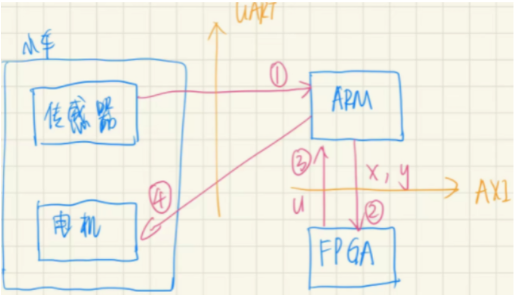

# 前言

使用FPGA实现MPC算法，并且在四轮小车上进行实验，实现了小车的给定轨迹跟踪

图中是

使用C或者C++编写控制程序，然后综合成一个IP核，因此，核心的部分是使用C写出控制程序，然后与已有的IP核进行通信。

## 推荐学习路径

### 使用ZYNQ

在ZYNQ开发板上实现一些已有的代码，跑一些例程，看文档PDF _ S2 的前5章，

### ARM

### HLS

### HLS +ARM

# 目标

## 目标一

将其包装成一个项目，用于找工作

项目：名称

用到：板子、软件

做什么：

算法：

## 目标二

毕业设计