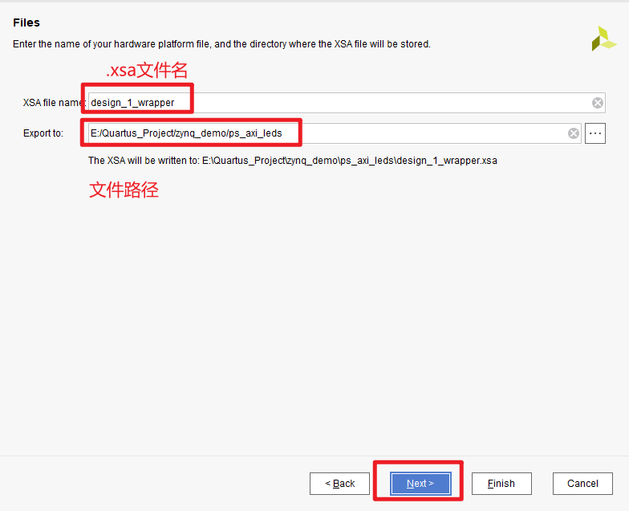

# 前言

使用到的工具如下

开发板：ZYNQ7350 采用 Xilinx 公司的 Zynq7000 系列的芯片，型号为 XC7Z035-2FFG676

芯片：ZYNQ7350 芯片可分成处理器系统部分 Processor System（PS）和可编程逻辑部分 Programmable
Logic（PL）

软件：vivado2020.1、vitis2020.1（用C语言，ARM）

# 项目

如果只使用PL模块去点灯，那么就写Verilog代码：**s1-4**

但是如果用PS通过总线去点灯，就需要在vitis中写C语言，实现点灯**s1-10**

注意：涉及到ARM核的实验，不能进行仿真，只能上板测试

## 开发流程

先拿点灯作为第一个练手的“小项目”，建立工程参照s1文件的第4章4.3之前（第4章是用Verilog写得代码，有详细的开发流程，PL的使用，`学`），工程建立完成，就看s1的第10章，这里第10章的教程不是很详细，可以参照项目板的s2中第1章，看到SDK时，又回到s2的第1章的第11）步，在26页，这部分在生成工软件开发人员使用的 xsa 文件，但是跟着教程走完发现灯不亮，后来发现这里的教程没有生成比特流。于是可以参照项目板s2中第13章161页生成比特流

---

### FPGA 工程师的工作

使用ps通过axi总线去点灯

---

#### 创建工程

创建一个新的工程


工程类型为：RTL


目标语言：Verilog


器件家族“Family”：“Zynq-7000”

封装类型“Package”：“ffg676”

在下拉列表中：“xc7z035ffg672-2”


工程创建成功


#### 创建Block设计

Block设计就是图形化设计

---

##### ZYNQ


弹出的窗口不做修改，点击OK就完事


添加ZYNQ处理器


双击列表中的搜索结果


双击图中的 ZYNQ 核


配置 Bank 电平标准，使能串口


配置 DDR3 型号为：“MT41J256M16 RE-125”


##### GPIO

添加一个 AXI GPIO 的 IP 核


双击刚才添加的“axi_gpio_0”配置参数


选择“All Outputs”，因为这里控制 LED，只要输出就可以了，“GPIO Width”填 4，控制 4
颗 LED，点击 OK


点击“Run Connection Automation”，可以完成部分自动连线


选择要自动连接的端口，这里全选，点击 OK


点击“Run Block Automation”


点击“Optimize Routing”，可以优化布局


修改 GPIO 端口的名称


##### 创建HDL文件

就是所有模块组合起来的那个文件

---


HDL文件创建完成


在生成的 Verilog 文件中，可以看到有个“leds_tri_o”的输出端口，要为他们分配管脚


##### 创建XDC 文件约束 PL 管脚：方法一

管脚约束

---


双击生成的.xdc文件


将下面的代码复制到.xdc文件中

```
set_property IOSTANDARD LVCMOS15 [get_ports {led_tri_o[2]}]
set_property IOSTANDARD LVCMOS15 [get_ports {led_tri_o[1]}]
set_property IOSTANDARD LVCMOS15 [get_ports {led_tri_o[0]}]
set_property PACKAGE_PIN F5 [get_ports {led_tri_o[0]}]
set_property PACKAGE_PIN E5 [get_ports {led_tri_o[1]}]
set_property PACKAGE_PIN G5 [get_ports {led_tri_o[2]}]
set_property PACKAGE_PIN G6 [get_ports {led_tri_o[3]}]
set_property IOSTANDARD LVCMOS15 [get_ports {led_tri_o[3]}]
```

##### 管脚约束：方法二

在进行管脚约束前，要先点击编译


---


##### 生成比特流

管脚约束完后，要点击`Run  Synthesis`     进行编译，然后才能生成比特流，（比特流需要下载到FPGA）

                                                                                                                                                                                                                                                                                                                                                                                                                

---


##### 生成xsa文件

选择 block 设计，右键“Generate Output Products”，此步骤会生成 block 的输出文件，包
括 IP，例化模板，RTL 源文件，XDC 约束，第三方综合源文件等等


导出硬件信息，这里就包含了 PS 端的配置


出现了下面的错误：


然后我删除了HDL 文件，然后重新生成，就成功了


在弹出的对话框中点击“OK”，选择包含比特流


---


重要：

如果是第一次生成.xsa文件，就继续B下面的操作，如果是之前已经生成，那就从A开始

---


###### A


可修改导出名字以及导出路径，默认是在 vivado 工程目录下的，这个文件可以根据自己的
需要在合适的位置，不一定要放在 vivado 工程下面，vivado 和 vitis 软件是独立的。在这
里选择默认不做更改。点击 Next



.xsa文件生成


此时在工程目录下可以看到 xsa 文件，这个文件就是这个文件就包含了 Vivado 硬件设计的信
息，可交由软件开发人员使用


到此为止，FPGA 工程师工作告一段落

### 软件工程师的工作

#### Vitis调试

vitis里面的程序，只涉及到ARM

---


点击“Create Application Project”，这个选项会生成 APP 工程以及Platfrom 工程，Platform 工程类似于以前版本的 hardware platform，包含了硬件支持的相关文件以及 BSP。


最下面的 Generate boot components 选项，如果勾选上，软件会自动生成 fsbl 工程，一般选择默认勾选上


填入 APP 工程名称，在方框处点击可以选择对应的处理器，这里保持默认


在这个界面可以修改 Domain 名称，选择操作系统，ARM 架构等，这里保持默认，操作系
统选择 standalone，也就是裸机


选择模板


#### C程序


锤子：工程编译


如果在vivado中修改，要回到vitis进行更新


在模板中修改程序，点亮一个灯


根据GPIO的官方手册，对Helloworld的模板修改如下：


#### 编译、上板运行

右键，Run As 后点击第一个

